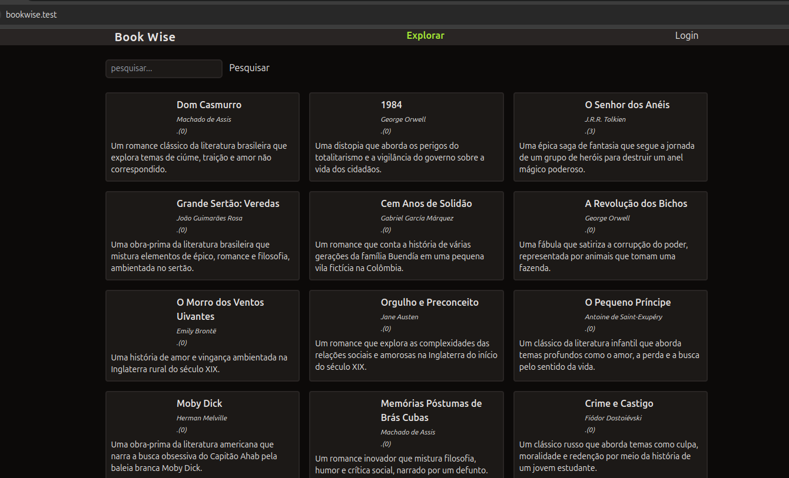

# bookwise

<h1 align="center">
    
</h1>

## 💻 Sobre o projeto

📄 Gerenciador simples de livros

Projeto de revisão do PHP, modulo da formação PHP da RocketSeat. No desenvolvimento utilizei o mysql com Docker,
o arquivo texto.txt, tem o sql das tabelas e alguns dados de livros para exibir na tabela de livros.
Tem alguns pontos de melhoria, porém não era o foco resolve-los.

---
## 🛠 Tecnologias
- PHP (puro)
- Tailwind
- Mysql
- Docker